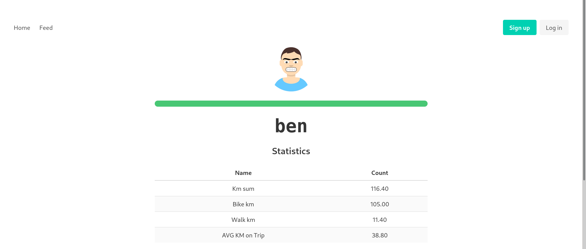
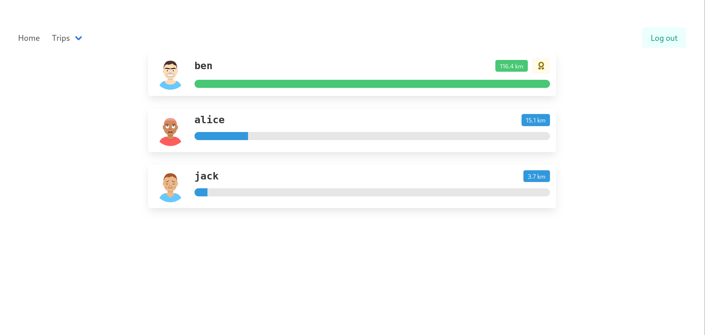

[Česky](https://github.com/ondrejholik/springkilometers/blob/master/PRECTIME.md)

# Spring-Kilometers
- Social network for tracking trips(walking, cycling). Sharing images, [gpx](https://en.wikipedia.org/wiki/GPS_Exchange_Format)

## Prerequisities
    - golang v1.14.0 and above
    - docker(for postgres)

## About project
- in czech: "Jarni kilometry" is annual tradition to walk 100km from March 20 to June 21(Spring in northern hemisphere).
- The Webapp helps with better tracking and user experience of the whole process.

## Features
 - registration/login
 - creating trips, joining/disjoining trips, deleting trips
 - uploading, cropping, resizing images
 - user statistics
   
 - sum of kilometers by user
   
 - Scoreboard of all users who were on at least one trip
